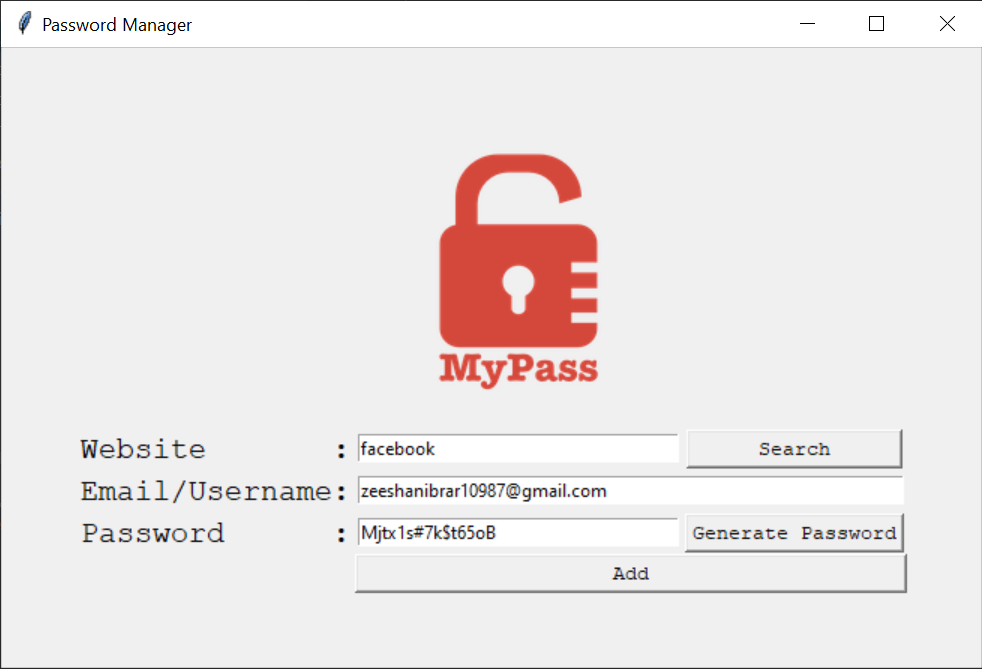
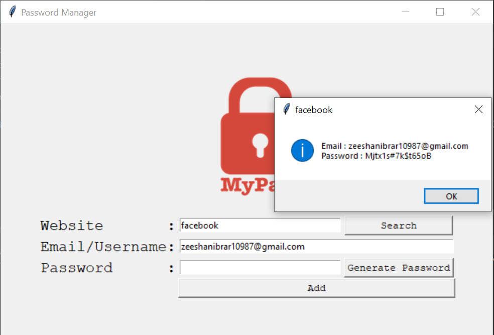

# Simple Password Manager

A simple password manager built using Python and Tkinter for a graphical user interface (GUI). This application allows users to generate, save, and retrieve passwords associated with different websites.

## Features

- **Password Generation:** Generate secure random passwords with a combination of letters, numbers, and symbols.

- **Save Passwords:** Save website details, including the website name, email/username, and password.

- **Search Functionality:** Search for and retrieve previously saved passwords by entering the website name.

- **Password Copying:** Easily copy generated or retrieved passwords to the clipboard.

## How to Use

1. **Clone the Repository:**
   ```bash
   git clone https://github.com/yourusername/password-manager.git
   cd password-manager
   
## Usage:

 - Enter the website name, email/username, and password.
 - Use the "Generate Password" button to create a random password.
 - Click "Add" to save the website details.
 - Use the "Search" button to retrieve saved passwords.

## Dependencies
 - Python
 - Tkinter

## Screenshots





